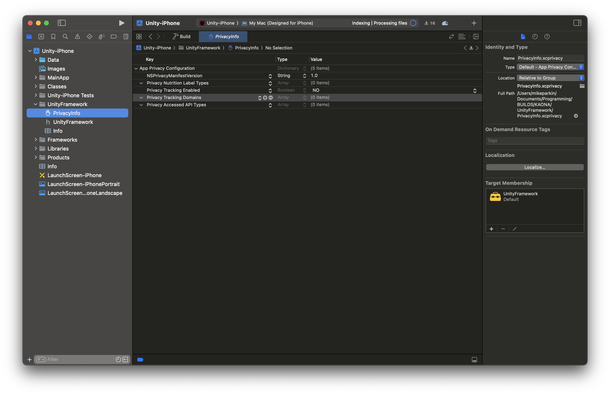

# 🌺 Kaona

**Kaona** is a four-player tabletop RPG and mobile “storyteller” app, designed to foster wellbeing from a Kānaka Maoli (Native Hawaiian) perspective by introducing the values of **lōkahi** (harmony).

---

## 📁 Project Overview

- **Engine:** Unity 2022.3.11f1  
- **Target Platform:** Android & iOS  
- **Original Creator:** Michael Parkin  
- **Lab Contact:** Rachel Baker-Ramos

---

## 🧱 Project Structure

Kaona uses a **scene-centric architecture**, where each Unity scene is mirrored by a consistent folder structure across assets such as audio, timings, scripts, and prefabs. This modular setup allows for organized development and facilitates easier debugging and iteration.

Because the project is heavily UI-based, it employs the **uGUI** UI system, with scenes and components prefabbed for streamlined editing.

Most files in each of the main folders follow the same numbered layout as the corresponding Unity scenes.

---

## 🗂️ File Structure (`Assets/`)

```plaintext
Assets/
├── Animations/              # Animator controllers and animation clips
├── Audio & Timings/         # SFX and audio timing data (for playback sync)
├── AudioTextSynchronizer/   # ATS v2.0 plugin files and extensions (external audio syncing package)
├── Editor/                  # Custom Unity Editor scripts and tools
├── External Assets/         # Fonts, models, or assets from external sources
├── Materials/               # All materials used for 3D objects and UI
├── Plugins/                 # Platform-specific plugins and code injectors
├── Prefabs/                 # Reusable object prefabs (UI, props, interactive items)
├── Rendering/               # Post-processing, lighting configs, or render profiles
├── Resources/               # Dynamically loaded assets (mostly deprecated)
├── Scenes/                  # All Unity scenes
├── Scripts/                 # Core game scripts (UI, systems, gameplay logic)
├── Shaders/                 # Custom or third-party shader files
├── StreamingAssets/         # ATS-generated auto-translate + sync files
├── Unity Files/             # Miscellaneous Unity-related files (templates, tools)
Packages/                    # Unity-managed package dependencies (do not modify manually)
```

### 📂 Example Sub-Folder Layout: `Audio & Timings`

Some folders, like `Audio & Timings/`, are further divided into Moku-based subfolders. These correspond to the initials of the six featured Moku in the experience:

```plaintext
Audio & Timings/
└── 5. Dialogue Selector & 6. Quest Results/
    ├── FE/   # Files and timing for Moku FE
    ├── FF/   # Files and timing for Moku FF
    ├── PB/   # Moku PB voice and timing data
    ├── SS/   # Moku SS
    ├── TM/   # Moku TM
    └── WS/   # Moku WS
```

This structure supports cleaner asset management, easier iteration, and reuse across Moku-specific scenes.

---

## 🎮 Major Scenes

| Scene Path                         | Function / Purpose                                               |
|-----------------------------------|------------------------------------------------------------------|
| 0. Pre-Start Animation            | Intro animation before the main menu loads                       |
| 1. Start Menu                     | Main UI for starting the game and enabling Storyteller Mode      |
| 2. Ancestor Intro                 | Narrative introduction that sets tone and context                |
| 3. Entry Sequence                 | First guided interactive sequence with narration and movement    |
| 4. Moku Selector                  | Core Moku selection hub – player chooses where to go next        |
| 5. Dialogue Screen (TEMPLATE)    | Template for all Moku-specific dialogue sequences                |
| 6. Quest Results (TEMPLATE)      | Template for Moku-specific completion results                    |

🔁 **Note:** Scenes 5 and 6 serve as template-based frameworks. Each Moku has its own dedicated scene that uses this shared prefab system. This makes the logic scalable while keeping flow and visuals consistent.

---

## 🔧 Core Systems

### 📦 `GameData.cs` & `GameDataManager.cs`

- Handles creation, loading, saving, and backup of `gameData.json`  
- Tracks all game data, including Moku completion, narration progress, and intro states

### 🗣 Audio Text Synchronizer (ATS)

- ATS v2.0 is used to synchronize subtitles and animate mesh text  
- Custom `MeshAnimation` scripts enable scrolling captions and effects  
- Text and audio data reside in `StreamingAssets/ATS`

🧩 **Third-party package used:**  
[Audio Text Synchronizer Documentation](https://unitymedved.bitbucket.io/ATS/2.1/Docs/index.html) — This tool powers the subtitle and audio-sync animation system used throughout all dialogue and narration scenes.

---

## 🚀 Build Instructions

1. **Open the project** in Unity 2022.3.11f1  
2. Go to Player Settings and incriment version
3. Go to `File > Build Settings`  
4. Set platform to **Android/iOS**  
5. Ensure all scenes are enabled in the build settings  
6. Click **Build and Run**  
7. Open the Xcode project and make any necessary signing and capabilities adjustments.  
   - Bundle Identifier **must** be com.theorycraftist-games.kaona (case-sensitive)
   - You must add the `PrivacyInfo.xcprivacy` file (found in `Assets > External Assets > Publishing`) to the `UnityFramework` folder in Xcode. In the side panel, make sure its Target Membership is set to **UnityFramework**.  
     ⚠️ Note: The build will fail App Store review if this file is missing. Unity did not automatically generate it in older Unity versions.  

      
8. For Android, you will receive a `.APK` file

---

## 👥 Contributors

| Name                   | Role                                       |
|------------------------|--------------------------------------------|
| Michael Parkin         | Lead Developer & Interaction Designer      |
| Rachel Baker-Ramos     | Lab Research Scientist & Lead UX Designer |

---

## 💡 Known Issues

_This section is currently a placeholder._

---

## 📌 Additional Notes

_This section is currently a placeholder._

---

## 📘 How to Create a Quest

To add a new quest to the game, follow these steps:

1. **Duplicate a Template Scene:**
   - Navigate to the `Scenes/` folder.
   - Duplicate the appropriate template scene:
     - Use `Dialogue Screen (TEMPLATE)` for dialogue-based quests.
     - Use `Quest Results (TEMPLATE)` for result/end-of-quest scenes.

2. **Update the Game Manager:**
   - Open the duplicated scene and locate the `GameManager` object.
   - Set the correct `Quest Moku` and `Quest Number` values.
   - Assign appropriate visualizer assets (e.g. animations, images, or 3D models specific to the quest).

3. **Add Audio Sources:**
   - In the scene, go to the `AudioManager` or equivalent component managing playback.
   - Add or update audio sources to include narration, SFX, or environmental sounds specific to the new quest.
   - Make sure audio timings are synced using ATS (Audio Text Synchronizer) if captions are needed.

4. **Organize Assets:**
   - Place related timing and audio files in the correct Moku folder under:
     - `Assets/Audio & Timings/`
     - `Assets/StreamingAssets/ATS/`

5. **Test the Scene:**
   - Play the scene in Unity and verify dialogue flows, visuals display correctly, and audio is synced.

---

## 🔮 Next Steps

- Implement quest audio skipping options:
  - Skip Option A and B voice readouts
  - Skip initial narration when replaying a quest
- Add a help button on the Quest Results screen:
  - Offers UI explanation for players who are confused or need a reminder

---

## 📄 License

This project was developed under educational, research, and community-based agreements.

---
